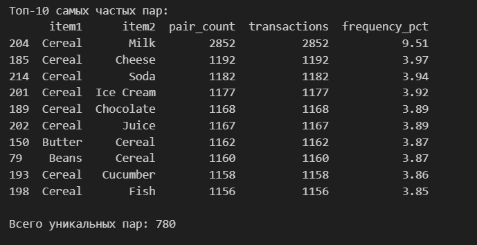
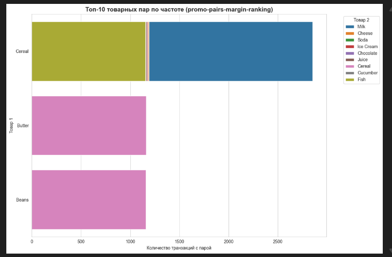

# Анализ товарных пар для промо-акций (promo-pairs-margin-ranking)  
## Цель проекта  
Маркетинговый отдел планирует акции с комплектными предложениями (товар A + товар B) и хочет понять:  
- Какие товары чаще всего покупают вместе;  
- Какую долю от всех транзакций занимают эти пары;  
- Как выглядит распределение размера корзины (сколько позиций в среднем покупают за раз).  

! В этом проекте реализован базовый анализ товарных пар по частоте (frequency‑based ranking).  
! В отдельном проекте планируется развитие темы: анализ маржинальности пар и визуализация в виде heatmap.  

## Данные  
Используется Retail Transaction Dataset (Kaggle, автор bkcoban):  ​
- 30 000 транзакций розничной сети;  
- описывают структуру чеков;  
- не содержат реальных клиентов или магазинов;  
- распространяются свободно для образовательных целей.  

##### Столбцы:  
`TransactionID` — уникальный идентификатор транзакции;  
`CustomerID` — идентификатор клиента;  
`Products` — строка со списком товаров в корзине, разделённых запятыми;  
`Timestamp` — дата и время покупки.  

### Важный момент:  
В описании набора данных указано, что это synthetic retail data: транзакции сгенерированы специально для аналитики, не основаны на реальных чеках и не содержат персональных данных.  ​
Это позволяет использовать датасет в открытых образовательных и портфельных проектах без нарушения требований по защите персональных данных.  

### Структура проекта  
##### Основные элементы проекта:  
`data/products.csv` — исходный датасет (30000 записей)  
`notebooks/01_eda_and_pairs.ipynb` — файл Jupiter Notebook для VS Code/браузера с исследованиями  
`screenshots/pairs-created.jpg` — созданные пары товаров  
`screenshots/top-10-pairs.jpg` — топ 10 самых частых пар товаров  
`screenshots/promo-pairs-margin-ranking.jpg` — график перспективных пар для промо-акций  
`screenshots/basket_size.jpg` — гистограмма размера корзины и количество товаров в ней  
`README.md` — описание проекта, целей, данных и результатов (этот файл)  
`requirements.txt` — список Python‑зависимостей.  

### Подход и методы анализа  
##### Основные шаги:  
###### Загрузка и первичный EDA:  
- Проверка типов данных и пропусков (все четыре столбца заполнены);  ​
- Разбор столбца Products в список товаров (product_list);  
- Расчёт размера корзины (basket_size) для каждой транзакции.  

###### Анализ размера корзины:  
- Исследование распределения количества товаров в корзине;  
- Построение гистограммы с линией плотности.  

###### Генерация товарных пар:  
- Для каждой корзины строятся все комбинации товаров по два с помощью itertools.combinations;  
- Внутри пары товары сортируются, чтобы (A, B) и (B, A) считались одной комбинацией.  

###### Расчёт метрик по парам:  
- pair_count — общее число появлений пары во всех корзинах;  
- transactions — число уникальных транзакций, где встречается пара;  
- frequency_pct — доля транзакций с данной парой от общего количества транзакций.  

###### Ранжирование:  
- Формируется таблица всех пар с метриками;  
- Строится рейтинг топ‑10 пар по числу транзакций.  

### Используемый стек:  
- Python: pandas, numpy, itertools;  
- Визуализация: seaborn, matplotlib;  
- Среда: Jupyter Notebook (выполняется в VS Code).  

### Основные результаты  
Пример ключевых наблюдений (по результатам ноутбука):  

  
Всего обнаружено 780 уникальных товарных пар.  
В топ‑10 по частоте доминируют комбинации вокруг продукта Cereal (хлопья) с молочными и сопутствующими товарами.  
Пара Cereal + Milk встречается почти в 10% всех транзакций, что делает её очевидным кандидатом для промо‑кампаний и кросс‑мерчендайзинга.  

В ноутбуке построены:  

  
горизонтальный bar‑chart для топ‑10 пар (ось X — количество транзакций, ось Y — товар 1, цвет — товар 2);  

  
гистограмма распределения размера корзины (3–10 позиций как основной диапазон).  ​

### Запуск ноутбука:  
1. Открыть папку проекта в VS Code.  
2. Убедиться, что установлены расширения Python и Jupyter.  
3. Выбрать интерпретатор Python, в котором установлены зависимости.  
4. Открыть ноутбук notebooks/01_eda_and_pairs.ipynb и выполнить ячейки по порядку.  

### Возможные направления развития  
План дальнейшего развития анализа:  
- добавить ценовые и себестоимостные параметры для товаров;  
- рассчитать маржинальность товарных пар;  
- построить heatmap по топ‑парам, ранжированным по марже;  
- сравнить средний чек (AOV) для чеков с промо‑парами и без них.  

## 📧 Контакты  
Разработчик: Ирина Васильевна  
📧 Email: irochkavinokurova@mail.ru  
📱 WhatsApp/Telegram: +7 (919) 128-29-95  

## 📄 Лицензия  
Проект использует открытый датасет Retail Transaction Dataset от Kaggle.com. Код распространяется свободно для образовательных целей.
